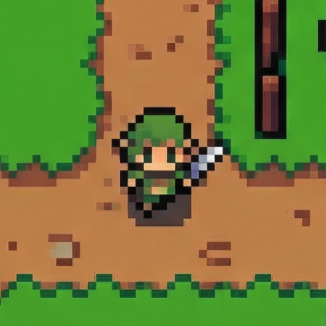
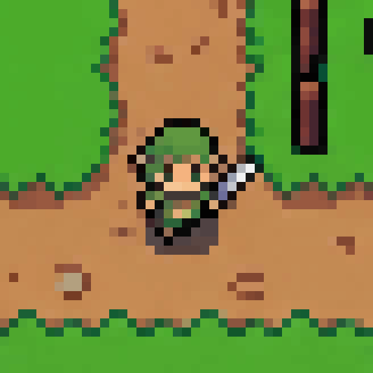

# fast-pixelizer

Fast, zero-dependency image pixelation library. Works in **browser** and **Node.js**.

[](https://www.npmjs.com/package/fast-pixelizer)
[](./LICENSE)
[](https://bundlephobia.com/package/fast-pixelizer)

---

## Snap Mode — Turn Fake Pixel Art into Real Pixel Art

Most pixel art you find online is **broken** — scaled up with blurry interpolation, anti-aliased edges, and misaligned grids. `snap()` automatically detects the original pixel grid and rebuilds it with perfectly uniform cells.

As of `1.2.0`, repeated `snap()` runs stay stable on already-clean images and square canvases no longer drift into mismatched X/Y grids.

Recent regression examples:

| Input                  | Previous           | `1.2.0`   |
| ---------------------- | ------------------ | --------- |
| `1.gemini.png`         | `201x201`          | `200x200` |
| `2.well-converted.png` | `65x69` on re-snap | `201x201` |
| `3.gpt.png`            | `148x150`          | `148x148` |
| `4.gpt.png`            | `98x179`           | `97x97`   |

|          Before (blurry, misaligned)          |           After (clean, uniform)            |                 After + Grid overlay                 |
| :-------------------------------------------: | :-----------------------------------------: | :--------------------------------------------------: |
|  |  |  |

**How it works:**

1. **K-means++ color quantization** — reduces noise to make grid edges detectable
2. **Edge profile analysis** — scans horizontal & vertical color boundaries
3. **Periodicity detection** — recovers the repeating cell size even when visible boundaries are sparse
4. **Lattice regularization** — rebuilds a globally uniform grid instead of letting local cut drift accumulate
5. **Majority-vote resampling** — picks the dominant color per cell
6. **Uniform re-rendering** — every cell gets the exact same pixel size

No manual resolution input needed. The grid is auto-detected.

**Input quality note**

`snap()` works best when the source image really came from a low-resolution square grid that was later scaled up.

ChatGPT-generated "pixel art" often bakes the inconsistency into the source image itself: some cells are already wider, taller, softer, or slightly off-axis before `snap()` ever sees them. In those cases `snap()` can regularize the output and force it back onto a square lattice, but it cannot perfectly recover information that was never on a clean grid to begin with, so quality is not guaranteed.

If you are generating new source images specifically for `snap()`, prefer Nano Banana or any workflow that preserves a true square low-res lattice from the start.

```ts
import { snap } from 'fast-pixelizer'

const result = snap(imageData)
// → { data, width, height, detectedResolution, colCuts, rowCuts }
```

---

## Pixelate Mode — Generate Pixel Art from Any Image

|           |             Original             |                   `clean`                    |                    `detail`                    |
| :-------: | :------------------------------: | :------------------------------------------: | :--------------------------------------------: |
| **32×32** |  |  |  |
| **64×64** |  |  |  |

**`clean`** — picks the most frequent color in each cell. Sharp, graphic pixel art look.

**`detail`** — averages all colors in each cell. Smoother gradients, more texture.

```ts
import { pixelate } from 'fast-pixelizer'

const result = pixelate(imageData, { resolution: 32 })
```

---

## Install

```bash
npm install fast-pixelizer
```

---

## Usage

The input accepts a browser `ImageData`, a `node-canvas` image data object, or any plain `{ data: Uint8ClampedArray, width: number, height: number }`.

### Browser

```ts
import { pixelate, snap } from 'fast-pixelizer'

const canvas = document.querySelector('canvas')
const ctx = canvas.getContext('2d')
ctx.drawImage(myImage, 0, 0)

const imageData = ctx.getImageData(0, 0, canvas.width, canvas.height)

// Generate pixel art
const result = pixelate(imageData, { resolution: 32 })

// Or repair existing pixel art
const repaired = snap(imageData)

// Draw back
const out = new ImageData(result.data, result.width, result.height)
ctx.putImageData(out, 0, 0)
```

### Node.js (with [sharp](https://sharp.pixelplumbing.com))

```ts
import sharp from 'sharp'
import { pixelate, snap } from 'fast-pixelizer'

const { data, info } = await sharp('./photo.png')
  .ensureAlpha()
  .raw()
  .toBuffer({ resolveWithObject: true })

const input = {
  data: new Uint8ClampedArray(data.buffer),
  width: info.width,
  height: info.height,
}

// Generate pixel art
const result = pixelate(input, { resolution: 32 })

// Or repair existing pixel art
const repaired = snap(input, { colorVariety: 64 })

await sharp(Buffer.from(result.data), {
  raw: { width: result.width, height: result.height, channels: 4 },
})
  .png()
  .toFile('./output.png')
```

---

## API

### `snap(input, options?): SnapResult`

Detects the pixel grid in existing pixel art and re-snaps it to a clean, uniform grid.

#### `options: SnapOptions`

| Option         | Type                      | Default      | Description                                                              |
| -------------- | ------------------------- | ------------ | ------------------------------------------------------------------------ |
| `colorVariety` | `number`                  | `32`         | K-means color count. Higher = more detail, slower detection.             |
| `output`       | `'original' \| 'resized'` | `'original'` | `'original'` = uniform grid at ~original size. `'resized'` = grid-sized. |

#### `SnapResult`

```ts
interface SnapResult {
  data: Uint8ClampedArray
  width: number
  height: number
  detectedResolution: number // auto-detected grid size
  colCuts: number[] // column boundaries (for grid overlay)
  rowCuts: number[] // row boundaries (for grid overlay)
}
```

---

### `pixelate(input, options): PixelateResult`

#### `input: ImageLike`

```ts
interface ImageLike {
  data: Uint8ClampedArray
  width: number
  height: number
}
```

Compatible with the browser's built-in `ImageData`, `node-canvas`, and raw pixel buffers.

#### `options: PixelateOptions`

| Option       | Type                      | Default      | Description                                                                                 |
| ------------ | ------------------------- | ------------ | ------------------------------------------------------------------------------------------- |
| `resolution` | `number`                  | **required** | Grid size. `32` means a 32×32 cell grid. Clamped to image dimensions automatically.         |
| `mode`       | `'clean' \| 'detail'`     | `'clean'`    | `'clean'` = most-frequent color per cell. `'detail'` = average color per cell.              |
| `output`     | `'original' \| 'resized'` | `'original'` | `'original'` = same dimensions as input. `'resized'` = output is `resolution × resolution`. |

#### `PixelateResult`

```ts
interface PixelateResult {
  data: Uint8ClampedArray
  width: number
  height: number
}
```

---

## Examples

```ts
// Snap: auto-detect grid and repair
snap(img)
snap(img, { colorVariety: 64, output: 'resized' })

// Pixelate: generate pixel art
pixelate(img, { resolution: 32 })
pixelate(img, { resolution: 64, mode: 'detail', output: 'resized' })
```

### Try it locally

Clone the repo and run the library against the sample image to see the output yourself:

```bash
git clone https://github.com/handsupmin/fast-pixelizer.git
cd fast-pixelizer
npm install
npm run examples
```

Output images will be written to `examples/`. Replace `docs/original.png` with any image to try your own.

---

## Performance

| Function   | Resolution | Image size | Time   |
| ---------- | ---------- | ---------- | ------ |
| `pixelate` | 32         | 512×512    | ~1ms   |
| `pixelate` | 128        | 512×512    | ~3ms   |
| `pixelate` | 256        | 1024×1024  | ~12ms  |
| `snap`     | auto       | 512×512    | ~50ms  |
| `snap`     | auto       | 1024×1024  | ~150ms |

- **`pixelate`**: pre-allocated `Uint16Array(32768)` bucket table — no `Map`, no per-call heap allocations.
- **`snap`**: K-means++ quantization + periodicity-guided grid recovery. Heavier than pixelate but still fast enough for real-time use.
- Cell boundaries use `Math.round` to eliminate pixel gaps and overlaps between adjacent cells.
- Both functions iterate in row-major order for CPU cache locality.
- Zero runtime dependencies.

---

## Web Worker (browser)

For large images, run inside a Worker to keep the main thread unblocked:

```ts
// pixelate.worker.ts
import { pixelate, snap } from 'fast-pixelizer'

self.onmessage = (e) => {
  const { input, options, mode } = e.data
  const result = mode === 'snap' ? snap(input, options) : pixelate(input, options)
  self.postMessage(result, [result.data.buffer]) // transfer buffer, no copy
}
```

```ts
// main thread
const worker = new Worker(new URL('./pixelate.worker.ts', import.meta.url), { type: 'module' })
worker.postMessage({ input, options, mode: 'snap' }, [input.data.buffer])
worker.onmessage = (e) => console.log(e.data) // SnapResult or PixelateResult
```

---

## Contributing

Contributions are welcome! See [CONTRIBUTING.md](./CONTRIBUTING.md).

---

## License

[MIT](./LICENSE)
