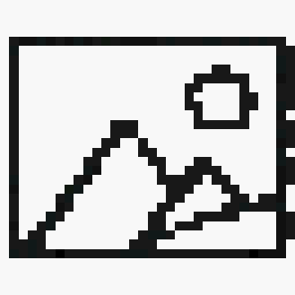

# fast-pixelizer

Fast, zero-dependency image pixelation library. Works in **browser** and **Node.js**.

[](https://www.npmjs.com/package/fast-pixelizer)
[](./LICENSE)
[](https://bundlephobia.com/package/fast-pixelizer)

---

## Overview

|           |             Original             |                   `clean`                    |                    `detail`                    |
| :-------: | :------------------------------: | :------------------------------------------: | :--------------------------------------------: |
| **32×32** |  |  |  |
| **64×64** |  |  |  |

**`clean`** — picks the most frequent color in each cell. Sharp, graphic pixel art look.

**`detail`** — averages all colors in each cell. Smoother gradients, more texture.

---

## Install

```bash
npm install fast-pixelizer
```

---

## Usage

```ts
import { pixelate } from 'fast-pixelizer'

const result = pixelate(imageData, { resolution: 32 })
// → { data: Uint8ClampedArray, width: number, height: number }
```

The input accepts a browser `ImageData`, a `node-canvas` image data object, or any plain `{ data: Uint8ClampedArray, width: number, height: number }`.

### Browser

```ts
import { pixelate } from 'fast-pixelizer'

const canvas = document.querySelector('canvas')
const ctx = canvas.getContext('2d')
ctx.drawImage(myImage, 0, 0)

const imageData = ctx.getImageData(0, 0, canvas.width, canvas.height)
const result = pixelate(imageData, { resolution: 32 })

// Draw back
const out = new ImageData(result.data, result.width, result.height)
ctx.putImageData(out, 0, 0)
```

### Node.js (with [sharp](https://sharp.pixelplumbing.com))

```ts
import sharp from 'sharp'
import { pixelate } from 'fast-pixelizer'

const { data, info } = await sharp('./photo.png')
  .ensureAlpha()
  .raw()
  .toBuffer({ resolveWithObject: true })

const result = pixelate(
  { data: new Uint8ClampedArray(data.buffer), width: info.width, height: info.height },
  { resolution: 32 },
)

await sharp(Buffer.from(result.data), {
  raw: { width: result.width, height: result.height, channels: 4 },
})
  .png()
  .toFile('./output.png')
```

---

## API

### `pixelate(input, options): PixelateResult`

#### `input: ImageLike`

```ts
interface ImageLike {
  data: Uint8ClampedArray
  width: number
  height: number
}
```

Compatible with the browser's built-in `ImageData`, `node-canvas`, and raw pixel buffers.

#### `options: PixelateOptions`

| Option       | Type                      | Default      | Description                                                                                 |
| ------------ | ------------------------- | ------------ | ------------------------------------------------------------------------------------------- |
| `resolution` | `number`                  | **required** | Grid size. `32` means a 32×32 cell grid. Clamped to image dimensions automatically.         |
| `mode`       | `'clean' \| 'detail'`     | `'clean'`    | `'clean'` = most-frequent color per cell. `'detail'` = average color per cell.              |
| `output`     | `'original' \| 'resized'` | `'original'` | `'original'` = same dimensions as input. `'resized'` = output is `resolution × resolution`. |

#### `PixelateResult`

```ts
interface PixelateResult {
  data: Uint8ClampedArray
  width: number
  height: number
}
```

---

## Examples

```ts
// Defaults: clean mode, original size
pixelate(img, { resolution: 32 })

// Average color, output as resolution × resolution
pixelate(img, { resolution: 64, mode: 'detail', output: 'resized' })

// Very blocky, 8×8 grid
pixelate(img, { resolution: 8 })
```

### Try it locally

Clone the repo and run the library against the sample image to see the output yourself:

```bash
git clone https://github.com/handsupmin/fast-pixelizer.git
cd fast-pixelizer
npm install
npm run examples
```

Output images will be written to `examples/`. Replace `docs/original.png` with any image to try your own.

---

## Performance

| Resolution | Image size | clean | detail |
| ---------- | ---------- | ----- | ------ |
| 32         | 512×512    | ~1ms  | ~0.5ms |
| 128        | 512×512    | ~3ms  | ~1ms   |
| 256        | 1024×1024  | ~12ms | ~5ms   |

- **`clean` mode** uses a pre-allocated `Uint16Array(32768)` bucket table — no `Map`, no per-call heap allocations.
- **`detail` mode** is a single accumulation pass with no allocations.
- Cell boundaries use `Math.round` to eliminate pixel gaps and overlaps between adjacent cells.
- Both modes iterate in row-major order for CPU cache locality.
- Zero runtime dependencies.

---

## Web Worker (browser)

For large images, run `pixelate` inside a Worker to keep the main thread unblocked:

```ts
// pixelate.worker.ts
import { pixelate } from 'fast-pixelizer'

self.onmessage = (e) => {
  const { input, options } = e.data
  const result = pixelate(input, options)
  self.postMessage(result, [result.data.buffer]) // transfer buffer, no copy
}
```

```ts
// main thread
const worker = new Worker(new URL('./pixelate.worker.ts', import.meta.url), { type: 'module' })
worker.postMessage({ input, options }, [input.data.buffer])
worker.onmessage = (e) => console.log(e.data) // PixelateResult
```

---

## Contributing

Contributions are welcome! See [CONTRIBUTING.md](./CONTRIBUTING.md).

---

## License

[MIT](./LICENSE)
