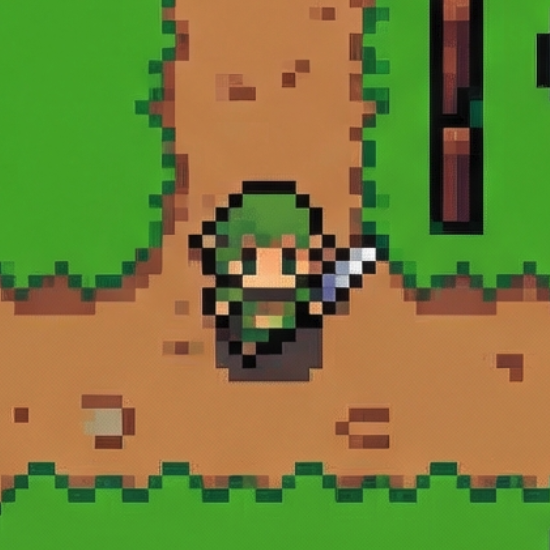
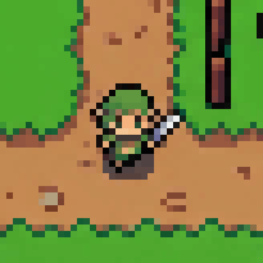
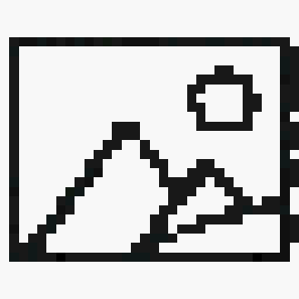

# fast-pixelizer

Fast, zero-dependency image pixelation library. Works in **browser** and **Node.js**.

[](https://www.npmjs.com/package/fast-pixelizer)
[](./LICENSE)
[](https://bundlephobia.com/package/fast-pixelizer)

---

## Snap Mode — Turn Fake Pixel Art into Real Pixel Art

Most pixel art you find online is **broken** — scaled up with blurry interpolation, anti-aliased edges, and misaligned grids. `snap()` automatically detects the original pixel grid and rebuilds it with perfectly uniform cells.

As of `1.2.0`, repeated `snap()` runs stay stable on already-clean images and square canvases no longer drift into mismatched X/Y grids.

As of `1.3.1`, high-resolution generated images are also evaluated against model and demo fixtures so the detector avoids snapping to tiny texture noise while keeping already-uniform snap outputs idempotent.

As of `1.3.2`, the quality loop also includes generated synthetic fixtures with known ground-truth grids, including blurred scaling, sparse same-color regions, rectangular grids, and transparent sprites.

As of `1.3.3`, the synthetic coverage also includes JPEG compression, non-integer scaling, and non-square scaled pixels, so a square source grid stretched with different X/Y scale factors can still be recovered.

As of `1.3.4`, the detector also recovers exact square pixelate outputs whose original-size render uses uneven `5px/6px` cell widths, fixing package-generated `64×64` examples that previously snapped to `39×39` or `66×66`.

As of `1.3.5`, the eval criteria additionally track boundary phase alignment, alpha preservation, RGB palette budget, low-palette retention, output coverage, and transparent padding. The detector now prefers a high-confidence uniform grid over a coarser transition grid when large transparent margins would otherwise dominate square sprites.

As of `1.3.6`, the uniform-cell detector also counts visible runs per sampled line, so partially cropped edge cells no longer make exact scaled pixel art under-count the source grid.

Recent regression examples:

| Input                  | Previous           | `1.2.0`   |
| ---------------------- | ------------------ | --------- |
| `1.gemini.png`         | `201x201`          | `200x200` |
| `2.well-converted.png` | `65x69` on re-snap | `201x201` |
| `3.gpt.png`            | `148x150`          | `148x148` |
| `4.gpt.png`            | `98x179`           | `97x97`   |

|          Before (blurry, misaligned)          |           After (clean, uniform)            |                 After + Grid overlay                 |
| :-------------------------------------------: | :-----------------------------------------: | :--------------------------------------------------: |
|  |  |  |

**How it works:**

1. **K-means++ color quantization** — reduces noise to make grid edges detectable
2. **Edge profile analysis** — scans horizontal & vertical color boundaries
3. **Periodicity detection** — recovers the repeating cell size even when visible boundaries are sparse
4. **High-resolution plausibility guard** — avoids treating 1–2px generated texture as the real grid
5. **Uniform-cell detection** — preserves already-snapped square-cell outputs on repeated runs
6. **Gated peak recovery** — recovers blurred scaled pixel art only when the current grid is clearly under-detected
7. **Exact transition recovery** — recovers clean square pixelate outputs with uneven original-size cell widths
8. **Transparent-padding arbitration** — keeps high-confidence uniform grids when transparent margins create stronger coarse transitions
9. **Edge-crop run counting** — preserves visible source-grid counts when edge cells are partially cropped
10. **Lattice regularization** — rebuilds a globally uniform grid instead of letting local cut drift accumulate
11. **Majority-vote resampling** — picks the dominant color per cell
12. **Uniform re-rendering** — every cell gets the exact same pixel size

No manual resolution input needed. The grid is auto-detected.

**Input quality note**

`snap()` works best when the source image really came from a low-resolution square grid that was later scaled up.

ChatGPT-generated "pixel art" often bakes the inconsistency into the source image itself: some cells are already wider, taller, softer, or slightly off-axis before `snap()` ever sees them. In those cases `snap()` can regularize the output and force it back onto a square lattice, but it cannot perfectly recover information that was never on a clean grid to begin with, so quality is not guaranteed.

If you are generating new source images specifically for `snap()`, prefer Nano Banana or any workflow that preserves a true square low-res lattice from the start.

### Snap quality eval

Run the model/demo/synthetic quality loop with:

```bash
npm run eval:snap-quality
```

The eval writes `summary.json`, `summary.md`, snapped images, and resized grid images under `.tmp/snap-quality-eval/`.

Current criteria include:

| Criterion           | What it catches                                                |
| ------------------- | -------------------------------------------------------------- |
| Aspect preservation | Crops or grids whose cell aspect drifts from the target ratio  |
| Ground truth        | Synthetic fixtures whose known grid is missed                  |
| Micro-grid snap     | Detectors that lock onto generated texture instead of cells    |
| Macro-grid snap     | Detectors that under-detect a large same-color block as a cell |
| Idempotence         | `snap(snap(image))` changing the detected grid                 |
| Determinism         | Two snaps of the same source disagreeing on grid size          |
| Output purity       | Snapped output cells that are not single-color or square       |
| Output coverage     | Original-size snap output shrinking too far from input size    |
| Transparent padding | Large transparent sprite margins causing coarse grid selection |
| Partial edge crop   | Cropped edge cells causing the visible source grid to shrink   |
| Palette budget      | Snapped RGB colors exceeding the requested color variety       |
| Palette retention   | Limited-palette inputs losing too many original RGB colors     |
| Boundary evidence   | Weak inferred boundaries compared with average image gradients |
| Phase alignment     | Inferred boundaries shifted away from nearby gradient peaks    |
| Source disorder     | Images whose inferred cells are internally noisy or painterly  |
| Preservation        | Excessive average or p95 error against the original image      |
| Alpha preservation  | Excessive average or p95 alpha error against the source        |
| Contrast            | Snapped output drifting too far from source contrast           |

The June 2026 model/demo fixture run improved from `5 fail / 5 pass / 6 review` with total repeat gap `273` to `0 fail / 11 pass / 5 review` with repeat gap `0`.

The expanded model/demo/synthetic run improved from `2 fail / 13 pass / 6 review`, expected-grid gap `78`, and repeat gap `54` to `0 fail / 15 pass / 6 review`, expected-grid gap `0`, and repeat gap `0`.

The `1.3.3` fixture expansion keeps the same hard failures at `0` across `24` fixtures: `0 fail / 17 pass / 7 review`, expected-grid gap `0`, and repeat gap `0`. A newly covered non-square scale case, a `40x40` source stretched to `320x240`, changed from `5x4` in `1.3.2` to the expected `40x40`.

The `1.3.5` transparent-padding run keeps hard failures at `0` across `27` images: `0 fail / 22 pass / 5 review`, expected-grid gap `0`, and repeat gap `0`. A `32x32` sprite with an 8-cell transparent border changed from `4x4` to the expected `32x32`.

The `1.3.6` partial-edge-crop run keeps hard failures at `0` across `28` images: `0 fail / 22 pass / 6 review`, expected-grid gap `0`, and repeat gap `0`. A `48x32` source cropped seven scaled pixels from every edge changed from `46x30` to the expected `48x32`.

```ts
import { snap } from 'fast-pixelizer'

const result = snap(imageData)
// → { data, width, height, detectedResolution, colCuts, rowCuts }
```

---

## Pixelate Mode — Generate Pixel Art from Any Image

|           |             Original             |                   `clean`                    |                    `detail`                    |
| :-------: | :------------------------------: | :------------------------------------------: | :--------------------------------------------: |
| **32×32** |  |  |  |
| **64×64** |  |  |  |

**`clean`** — picks the most frequent color in each cell. Sharp, graphic pixel art look.

**`detail`** — averages all colors in each cell. Smoother gradients, more texture.

```ts
import { pixelate } from 'fast-pixelizer'

const result = pixelate(imageData, { resolution: 32 })
```

---

## Install

```bash
npm install fast-pixelizer
```

---

## Usage

The input accepts a browser `ImageData`, a `node-canvas` image data object, or any plain `{ data: Uint8ClampedArray, width: number, height: number }`.

### Browser

```ts
import { pixelate, snap } from 'fast-pixelizer'

const canvas = document.querySelector('canvas')
const ctx = canvas.getContext('2d')
ctx.drawImage(myImage, 0, 0)

const imageData = ctx.getImageData(0, 0, canvas.width, canvas.height)

// Generate pixel art
const result = pixelate(imageData, { resolution: 32 })

// Or repair existing pixel art
const repaired = snap(imageData)

// Draw back
const out = new ImageData(result.data, result.width, result.height)
ctx.putImageData(out, 0, 0)
```

### Node.js (with [sharp](https://sharp.pixelplumbing.com))

```ts
import sharp from 'sharp'
import { pixelate, snap } from 'fast-pixelizer'

const { data, info } = await sharp('./photo.png')
  .ensureAlpha()
  .raw()
  .toBuffer({ resolveWithObject: true })

const input = {
  data: new Uint8ClampedArray(data.buffer),
  width: info.width,
  height: info.height,
}

// Generate pixel art
const result = pixelate(input, { resolution: 32 })

// Or repair existing pixel art
const repaired = snap(input, { colorVariety: 64 })

await sharp(Buffer.from(result.data), {
  raw: { width: result.width, height: result.height, channels: 4 },
})
  .png()
  .toFile('./output.png')
```

---

## API

### `snap(input, options?): SnapResult`

Detects the pixel grid in existing pixel art and re-snaps it to a clean, uniform grid.

#### `options: SnapOptions`

| Option         | Type                      | Default      | Description                                                              |
| -------------- | ------------------------- | ------------ | ------------------------------------------------------------------------ |
| `colorVariety` | `number`                  | `32`         | K-means color count. Higher = more detail, slower detection.             |
| `output`       | `'original' \| 'resized'` | `'original'` | `'original'` = uniform grid at ~original size. `'resized'` = grid-sized. |

#### `SnapResult`

```ts
interface SnapResult {
  data: Uint8ClampedArray
  width: number
  height: number
  detectedResolution: number // auto-detected grid size
  colCuts: number[] // column boundaries (for grid overlay)
  rowCuts: number[] // row boundaries (for grid overlay)
}
```

---

### `pixelate(input, options): PixelateResult`

#### `input: ImageLike`

```ts
interface ImageLike {
  data: Uint8ClampedArray
  width: number
  height: number
}
```

Compatible with the browser's built-in `ImageData`, `node-canvas`, and raw pixel buffers.

#### `options: PixelateOptions`

| Option       | Type                       | Default      | Description                                                                            |
| ------------ | -------------------------- | ------------ | -------------------------------------------------------------------------------------- |
| `resolution` | `number \| { cols, rows }` | **required** | Grid size. `32` keeps legacy 32×32 output. `{ cols, rows }` enables rectangular grids. |
| `mode`       | `'clean' \| 'detail'`      | `'clean'`    | `'clean'` = most-frequent color per cell. `'detail'` = average color per cell.         |
| `output`     | `'original' \| 'resized'`  | `'original'` | `'original'` = same dimensions as input. `'resized'` = output is grid-sized.           |

#### `PixelateResult`

```ts
interface PixelateResult {
  data: Uint8ClampedArray
  width: number
  height: number
}
```

For non-square crops, use `fitResolutionToAspect(input, n)` to turn a single scalar into a rectangular grid while keeping square cells:

```ts
const grid = fitResolutionToAspect(imageData, 64)
// 5:2 image → { cols: 160, rows: 64 }

const result = pixelate(imageData, {
  resolution: grid,
  output: 'resized',
})
```

---

## Examples

```ts
// Snap: auto-detect grid and repair
snap(img)
snap(img, { colorVariety: 64, output: 'resized' })

// Pixelate: generate pixel art
pixelate(img, { resolution: 32 })
pixelate(img, { resolution: { cols: 80, rows: 32 } })
pixelate(img, { resolution: 64, mode: 'detail', output: 'resized' })
```

### Try it locally

Clone the repo and run the library against the sample image to see the output yourself:

```bash
git clone https://github.com/handsupmin/fast-pixelizer.git
cd fast-pixelizer
npm install
npm run examples
```

Output images will be written to `examples/`. Replace `docs/original.png` with any image to try your own.

---

## Performance

| Function   | Resolution | Image size | Time   |
| ---------- | ---------- | ---------- | ------ |
| `pixelate` | 32         | 512×512    | ~1ms   |
| `pixelate` | 128        | 512×512    | ~3ms   |
| `pixelate` | 256        | 1024×1024  | ~12ms  |
| `snap`     | auto       | 512×512    | ~50ms  |
| `snap`     | auto       | 1024×1024  | ~150ms |

- **`pixelate`**: pre-allocated `Uint16Array(32768)` bucket table — no `Map`, no per-call heap allocations.
- **`snap`**: K-means++ quantization + periodicity-guided grid recovery. Heavier than pixelate but still fast enough for real-time use.
- Cell boundaries use `Math.round` to eliminate pixel gaps and overlaps between adjacent cells.
- Both functions iterate in row-major order for CPU cache locality.
- Zero runtime dependencies.

---

## Web Worker (browser)

For large images, run inside a Worker to keep the main thread unblocked:

```ts
// pixelate.worker.ts
import { pixelate, snap } from 'fast-pixelizer'

self.onmessage = (e) => {
  const { input, options, mode } = e.data
  const result = mode === 'snap' ? snap(input, options) : pixelate(input, options)
  self.postMessage(result, [result.data.buffer]) // transfer buffer, no copy
}
```

```ts
// main thread
const worker = new Worker(new URL('./pixelate.worker.ts', import.meta.url), { type: 'module' })
worker.postMessage({ input, options, mode: 'snap' }, [input.data.buffer])
worker.onmessage = (e) => console.log(e.data) // SnapResult or PixelateResult
```

---

## Contributing

Contributions are welcome! See [CONTRIBUTING.md](./CONTRIBUTING.md).

---

## License

[MIT](./LICENSE)
